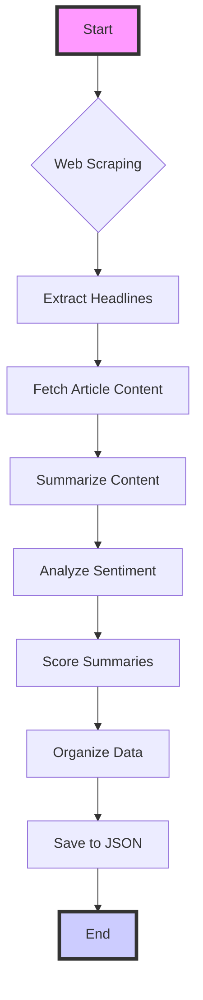

# BBC News Headline Analyzer

This Python script automates the process of fetching, summarizing, and analyzing the top headlines from the BBC website. This document outlines how the script operates, the rationale behind certain design choices, and its potential for scalability.

Utilizing a combination of Selenium for web scraping, NLTK for sentiment analysis, and the Anthropic API for content summarization, this script showcases a streamlined approach to news content processing and analysis.

- Demo video: https://www.loom.com/share/5490564eb3fa4498b1f1d8fe53364b56?sid=c09a0527-6e5a-4f35-94f6-1a5b678a7213 

## Overview: How the Script Meets the Challenge

The script adeptly meets the specified challenge by executing a series of well-defined tasks:
- **Navigates** to the BBC News website using Selenium, automatically handling dynamic content loading.
- **Extracts** the top 5 news stories, including headlines, descriptions, and links to full articles.
- **Summarizes** the content of each story using the Claude version 1 model from Anthropic, chosen for its efficiency and adequacy for this task.
- **Ranks** these summaries based on a heuristic scoring system that evaluates length, sentiment, and other factors.
- **Presents** the results in JSON format, a structured and widely used data interchange format.

## Running the Application: Step-by-Step Guide

1. **Environment Setup:**
   - Ensure Python is installed on your system.
   - Install required Python packages via `pip install -r requirements.txt`.

2. **Configuration:**
   - Update the `.env` file with necessary configurations (e.g., BBC URL, API keys).

3. **Execution:**
   - Run the script with `python app.py` from the terminal.
   - The script will automatically perform all tasks, from fetching headlines to saving analyzed summaries in JSON format.

4. **Output:**
   - Check the generated JSON files (`headlines_data.json`, `news_summaries.json`, `news_summaries_scored.json`) for the processed data.

5. **Review and Analysis:**
   - Open the JSON files to review the fetched headlines, their summaries, sentiment analysis, and quality scores.

## Technical Aspects of the Solution

### Simplifying with a Python Script

A Python script offers a concise, readable, and efficient solution for this challenge, eliminating the need for additional JavaScript/TypeScript development. This choice ensures that:
- The application remains lightweight and easy to deploy.
- Development and maintenance efforts are minimized.
- The script can be quickly adapted or extended as needed.

### Architecture for Scalability

- **Modularity:** Each component (scraping, summarizing, sentiment analysis) is encapsulated, allowing for independent updates or improvements.
- **API Potential:** The script is structured to facilitate transformation into a RESTful API, enabling broader application use.
- **Data Handling:** Utilizes JSON for data organization, simplifying integration with databases or other applications for further analysis.

To provide a clear and concise explanation of your script's architecture and its operational flow, I'll break down the main components and their interactions.
This description will be followed by a Mermaid diagram for visual representation.

### Code Architecture and Workflow

The script is structured around several key functions, each responsible for a distinct aspect of the process, from fetching news headlines to analyzing their content. Here's how it works in simple terms:

1. **Initialization and Web Scraping:**
   - The script begins by initializing a Selenium WebDriver, configured to run in headless mode for efficient background operation.
   - It navigates to the BBC News website, waits for the dynamic content to load, and then scrapes the page for news headlines, descriptions, and links.

2. **Data Extraction:**
   - Extracted data is categorized into main headlines and other news, based on predefined selectors stored in environment variables. This allows for flexibility and easy adjustments to target different page elements if needed.

3. **Content Summarization:**
   - For each relevant article link, the script fetches the full article content using Selenium.
   - It then calls the Anthropic API with a summarization prompt to generate a concise summary of the article.

4. **Sentiment Analysis:**
   - The NLTK library's Sentiment Intensity Analyzer evaluates the sentiment of each summary, classifying it as positive, neutral, or negative.

5. **Quality Scoring:**
   - A custom scoring algorithm assesses each summary based on length, capitalization, and punctuation. This heuristic approach provides an additional metric for evaluating content quality.

6. **Data Organization and Storage:**
   - The script organizes the processed data (headlines, summaries, sentiment analysis, and quality scores) into a structured JSON format for easy access and further use.
   - It saves this data to local files, making it available for reporting, analysis, or integration with other applications.

7. **Scalability Considerations:**
   - The modular design ensures that each component of the script (e.g., web scraping, content summarization, sentiment analysis) can be independently modified, tested, or replaced without affecting the overall functionality.
   - This architecture supports scalability, making it straightforward to transform the script into a more complex application, such as a RESTful API or a microservice within a larger ecosystem.

#### Mermaid Diagram

Here's a Mermaid diagram to visually represent the script's workflow:

### Why Not LangChain?

LangChain is a powerful tool for building language model applications, especially when integrating multiple language models or complex workflows. However, for this specific task, using LangChain could be considered overengineering for several reasons:
- **Simplicity of Tasks:** The core functionalities (web scraping, calling an API, sentiment analysis) are straightforward and can be achieved with well-documented, widely-used libraries.
- **Overhead and Complexity:** Integrating LangChain would introduce additional complexity and dependencies not necessary for the relatively simple operations being performed.
- **Direct Claude Usage:** The script directly interacts with Anthropic, in a simple way, which does not require the abstraction layer LangChain provides.

### Decision Algorithms

The script employs a few simple yet effective algorithms for its operations:
- **Content Summarization and Relevance Checking:** It uses pre-defined prompts in combination with the Anthropic's Claude to identify relevant headlines and summarize content. The relevance is determined by matching the output against a list of criteria (e.g., presence in a specific section).
- **Sentiment Analysis:** The sentiment of each summary is analyzed using NLTK's VADER, a lexicon and rule-based sentiment analysis tool optimized for social media text. It assigns a sentiment score based on the detected polarity of the text.
- **Scoring System for Summaries:** Implements a custom algorithm that scores summaries based on length, capitalization, punctuation, and sentiment, facilitating an objective comparison.

#### The Sufficiency of Claude v1 Over Claude v3

Claude v1 is chosen for its capabilities in generating accurate and coherent text summaries. This version is entirely adequate for the task, providing a balance between performance and resource usage without the need for the more advanced features of Claude v3, which might include finer nuances in language generation not required for summary tasks.

### Scalability and Architecture

The script's architecture is designed with simplicity and modularity in mind, making it suitable for scaling and further development:
- **Modular Functions:** Each major step (e.g., scraping, summarizing, analyzing) is encapsulated within its own function, facilitating maintenance, testing, and reuse.
- **Ease of Expansion:** The script can easily be adapted into a RESTful API, enabling integration into web applications or serving as a backend service for front-end interfaces.
- **Data Storage and Handling:** The use of JSON for data storage and exchange simplifies integration with databases and other data processing tools, enabling easy expansion and compatibility with big data technologies.
- **Configurability:** External configuration (e.g., environment variables for URLs and selectors) enhances flexibility, allowing the script to adapt to changes in the website structure or API endpoints without code changes.

## Conclusion

This script provides a robust foundation for automated news analysis, combining web scraping, API integration, and sentiment analysis in a straightforward, modular codebase. Its design choices prioritize simplicity, modularity, and ease of use, offering a clear path for expansion into larger applications or integration into more complex systems.
